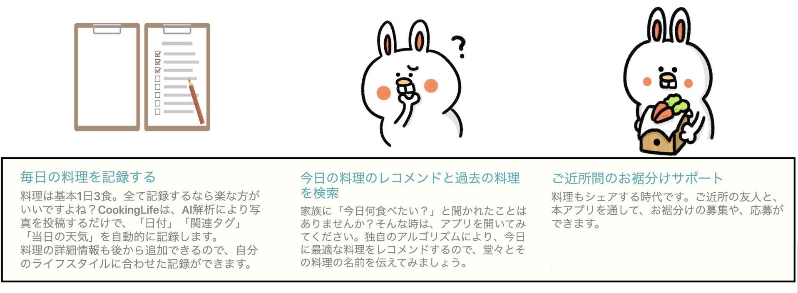
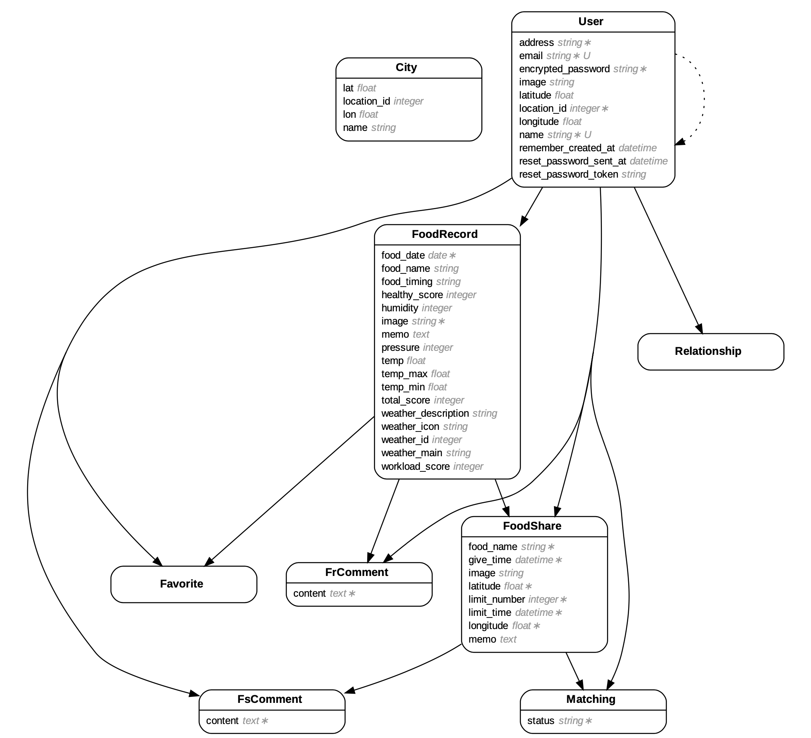

# README

# CookingLife ー総合料理サポートアプリー

  

 

# 作成経緯とアプリ概要
実家暮らしの私は、母親から毎日のように「今日何が食べたい？」と聞かれます。
しかし、適当に回答しても却下されてしまうので難しいという課題がありました。また、友人にも話を聞いてみると、同じ悩みを持った方が多いことが分かりました。
そこで開発したCookingLifeアプリは、過去に記録した料理から、今日食べたいと思いそうな料理をレコメンドしてくれます。つまり、「今日何が食べたい？」と聞かれた時に、アプリを見れば「今日はこれが食べたい」と的確に即答することが可能です。

毎日使用するアプリですので、モバイルファーストなデザインにし、料理画像をアップロードするだけでも多くの情報が記録できるよう設計しています。

また、料理を作る側の方にもメリットがあるよう、お裾分け機能を実装しています。ご近所同士で、本アプリを通してお裾分け連絡を取り合うことで、お裾分け料理詳細・待ち合わせ場所・日時を共有した上で、「もらう側」と「あげる側」がマッチングすることができます。

# 使用例

## TOPページ/レコメンド

## 料理記録(画像アップロード)

## 料理検索

## 料理お裾分け

# ER図
rails-ERDを使用して出力

# 制作期間
- 2020年11/26〜2021年3/19 (約4ヶ月)
- 設計書作成〜開発完了の期間
- 適宜改修予定
- AWSにデプロイ予定

# 開発手法
- プルリクを使った開発
- issue管理
- RSpecによるテスト駆動開発
- CircleCIによるpush時の自動テスト

## フロントエンド
- HTML
- SCSS
- webpacker
- bootstrap4
- Javascript

## バックエンド
- Ruby 2.6.6
- Ruby on Rails 6.0.3

## インフラ・開発環境
- Docker/docker-compose
- RSpec
- selenium
- capybara
- factory_bot
- CircleCI
- rubocop
- webmock

# ライブラリ
## タグ
- acts-as-taggable-on
## 検索
- ransack
## 画像アップロード
  - carrierwave (画像アップロード)
  - mini_magick (画像整形)
## デザイン
  - font-awesome
  - kaminari(ページネーション)
  - chart.js(グラフ表示)
  - drawer.js(横スライドメニュー表示)
  - datetimepicker(日時のカレンダー入力フォーム)

# 外部API
- OpenWeatherMap API (天気情報)
- Google Cloud Vision API (画像解析)
- Maps JavaScript API (GoogleMapを動的に使用)
- Geocoding API (住所・緯度経度の変換)
- Distance Matrix API (徒歩にかかる時間と距離表示)

# 機能一覧

## 料理記録機能
### 料理記録機能
- 画像アップロード
  - 画像を歪めずに正方形に整形
  - 画像プレビュー表示
### 料理画像解析機能
  - 料理画像プレビュー時に、画像解析
    - 料理かどうかの識別 ⇨ 料理以外の画像は投稿制限
    - タグを自動入力 ex) ラーメン画像ならば、「麺」というタグを自動入力
### 天気情報の取得
  - 画像保存時に自動的に居住地域の現在の天気を記録する

## 料理レコメンド・検索機能
### 独自アルゴリズムによるレコメンド
  - レコメンドの条件
    - 前日食べた料理の傾向(オイリーか手間がかかったか)と最も異なる料理
    - 前日食べた料理の主食が麺ならば麺以外の料理
    - 最近1週間の料理からは選ばない
- 天気情報を活用したレコメンド
  - 居住地域の現在の気温と最も近い日に食べた料理をレコメンド

## 料理お裾分け機能
- マッチング
  - お裾分け募集中の料理と、お裾分けされたいユーザを結びつける
- GoogleMapの活用
  - 居住地域や、お裾分け待ち合わせ場所の表示
  - ピンを立てることによる、場所の指定
- 距離と徒歩にかかる時間を取得

## 共通機能・その他
### レコメンド機能
- 前日の料理の傾向から分析した今日の料理のレコメンド
- 天気情報を用いた今日の料理のレコメンド
### ユーザー関連
- フォロー機能・友達機能
  - 相互フォロー状態を「友達」と判定する機能
- ゲストログイン機能
  - ポートフォリオ閲覧者用に、ワンクリックでログインできる機能
### いいね機能
- Ajaxで実装
### コメント機能
- Ajaxで実装

# アピールポイント
## テスト
- テストを136件作成
- 正常系、異常系、境界値分析の観点で作成
- 外部APIはモックを適宜作成し対応
- modelテスト、requestテスト、systemテストを作成
- CircleCIのテスト結果を、READMEのバッジで表示

## 外部APIの適用
- 課題解決型で必要なAPIをリサーチし使用

## QiitaやTwitterによる外部発信
- Qiita9件執筆、LGMT5件、ストック5件  
  https://qiita.com/engineer_ikuzou
- Twitterで毎日の積み上げを発信 
  https://twitter.com/@engineer_ikuzou

# 苦労した点
- 多くのアソシエーションを持つモデルの扱い
- 外部APIが関連するテストの作成
